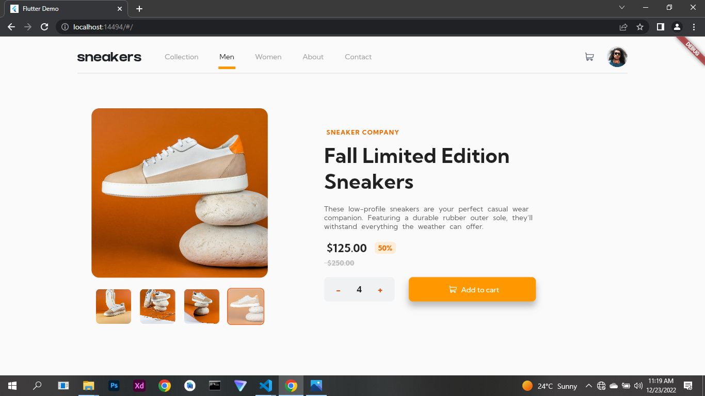

# Frontend Mentor - E-commerce product page solution

This is a solution to the [E-commerce product page challenge on Frontend Mentor](https://www.frontendmentor.io/challenges/ecommerce-product-page-UPsZ9MJp6). Frontend Mentor challenges help you improve your coding skills by building realistic projects.

## Table of contents

- [Overview](#overview)
  - [The challenge](#the-challenge)
  - [Screenshot](#screenshot)
- [My process](#my-process)
  - [Built with](#built-with)
  - [What I learned](#what-i-learned)
  - [Continued development](#continued-development)
  - [Useful resources](#useful-resources)
- [Author](#author)
- [Acknowledgments](#acknowledgments)

## Overview

### The challenge

Users should be able to:

- View the optimal layout for the site depending on their device's screen size
- See hover states for all interactive elements on the page
- Open a lightbox gallery by clicking on the large product image
- Switch the large product image by clicking on the small thumbnail images
- Add items to the cart
- View the cart and remove items from it

### Screenshot



## My process

### Built with

- Flutter and Dart

### What I learned

I learnt a great deal working on this project, making it reponsive and preventing screen overflow, i tried different methods of resolving the issue but the best was to use mediaquery rather than hard coding desired width and height, mediaquery exposes the device screen width and height and other component which enable one to create a better responsive realistic app that looks good on both web and mobile.

To access device width and height the following command can be used to access the size of the running device using mediaquery.

```dart
final size = MediaQuery.of(context).size;

```

After accessing  the size of the device the width or height can easily be expose including default padding, this will enable one to properly calculate available space to fit in ones design

```dart
//Exposes the device width
size.width;

//Exposes device height
size.height;

}
```

I created a list of maps that has the real image and the thumbnails which enabled me to dynamicly change the image on click of the thumbnail based on the given index in the list.

```dart

List<Map<String, String>> thumbnails = [
  {
    "thumbnails": "assets/image/image-product-1-thumbnail.jpg",
    "image": "assets/image/image-product-1.jpg"
  },
  {
    "thumbnails": "assets/image/image-product-2-thumbnail.jpg",
    "image": "assets/image/image-product-2.jpg"
  },
  {
    "thumbnails": "assets/image/image-product-3-thumbnail.jpg",
    "image": "assets/image/image-product-3.jpg"
  },
  {
    "thumbnails": "assets/image/image-product-4-thumbnail.jpg",
    "image": "assets/image/image-product-4.jpg"
  }
];
}
```

### Continued development

Subsequently i will focus on improving the look and feel of the app and integrate a backend to it to make it a full flashed e-commerce site and mobile app

### Useful resources

Check out these few resources to get you started if this is your first flutter project:

- [Lab: Write your first Flutter app](https://docs.flutter.dev/get-started/codelab)
- [Cookbook: Useful Flutter samples](https://docs.flutter.dev/cookbook)

## Author

<!-- - Website - [Add your name here](https://www.your-site.com) -->
<!-- - Frontend Mentor - [@yourusername](https://www.frontendmentor.io/profile/yourusername) -->
- Uma Godwin Eke
- Linkedin - [@godwinekeuma](https://www.linkedin.com/in/godwinekeuma)
- Email - [godwinekeuma@gmail.com](https://www.frontendmentor.io/profile/yourusername)
- Twitter - [@godwinekeuma](https://www.twitter.com/godwinekeuma)

## Acknowledgments

I really want to appreciate Temitope David for encouraging me to join the challange, have really learnt alot am sure his design using html, css and javascript will be wow :-).
